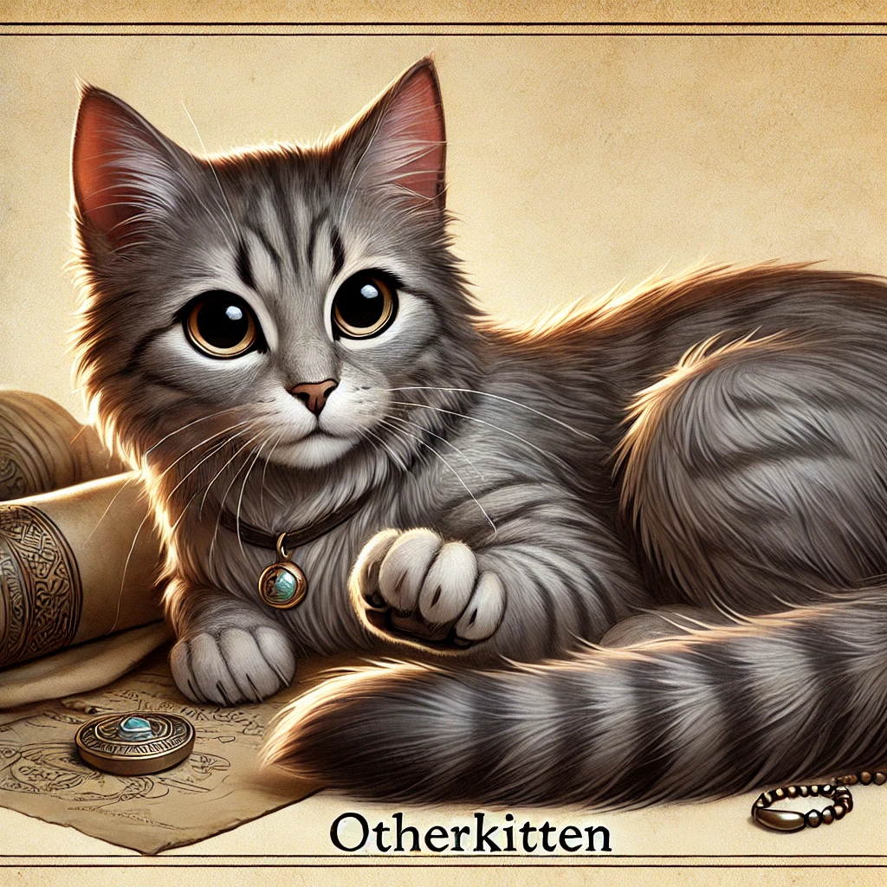
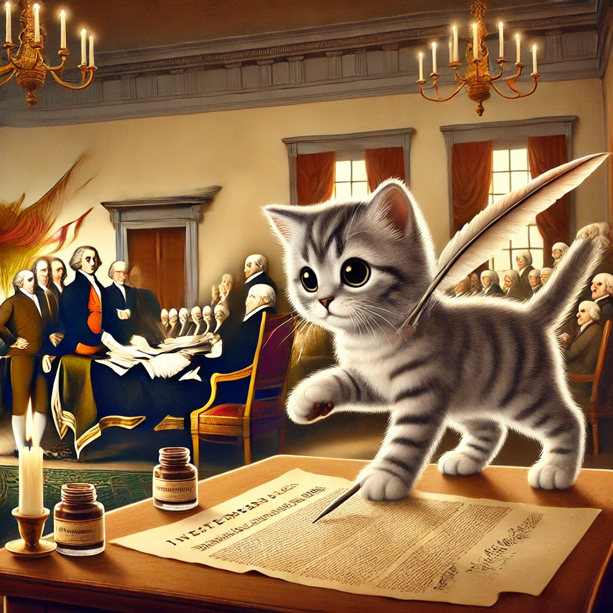
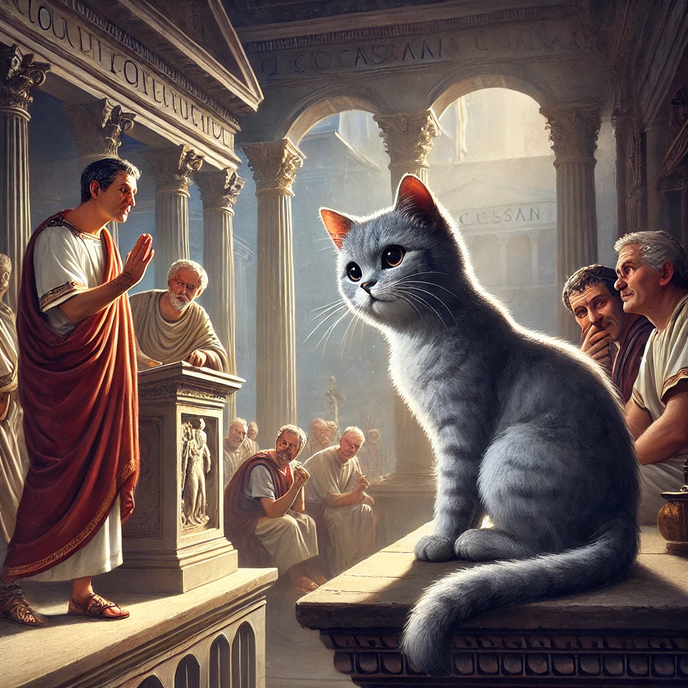
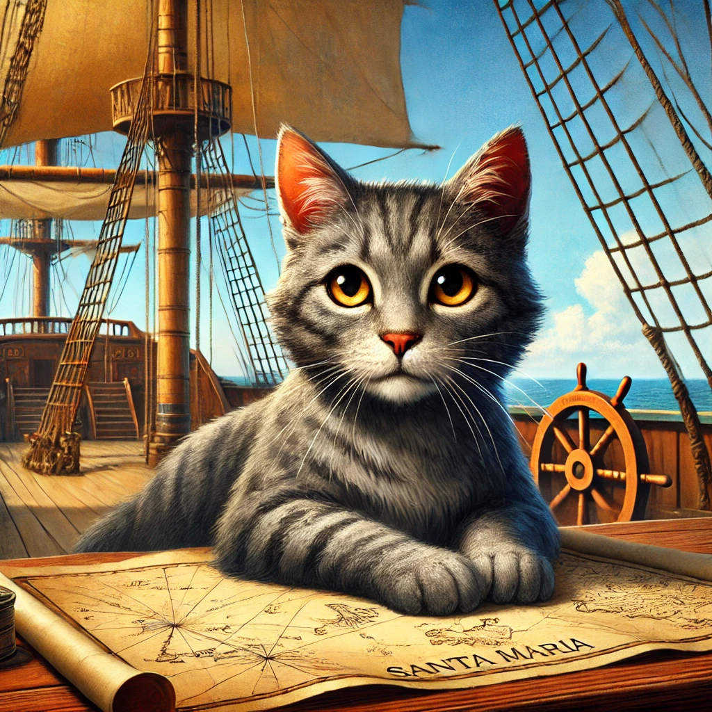
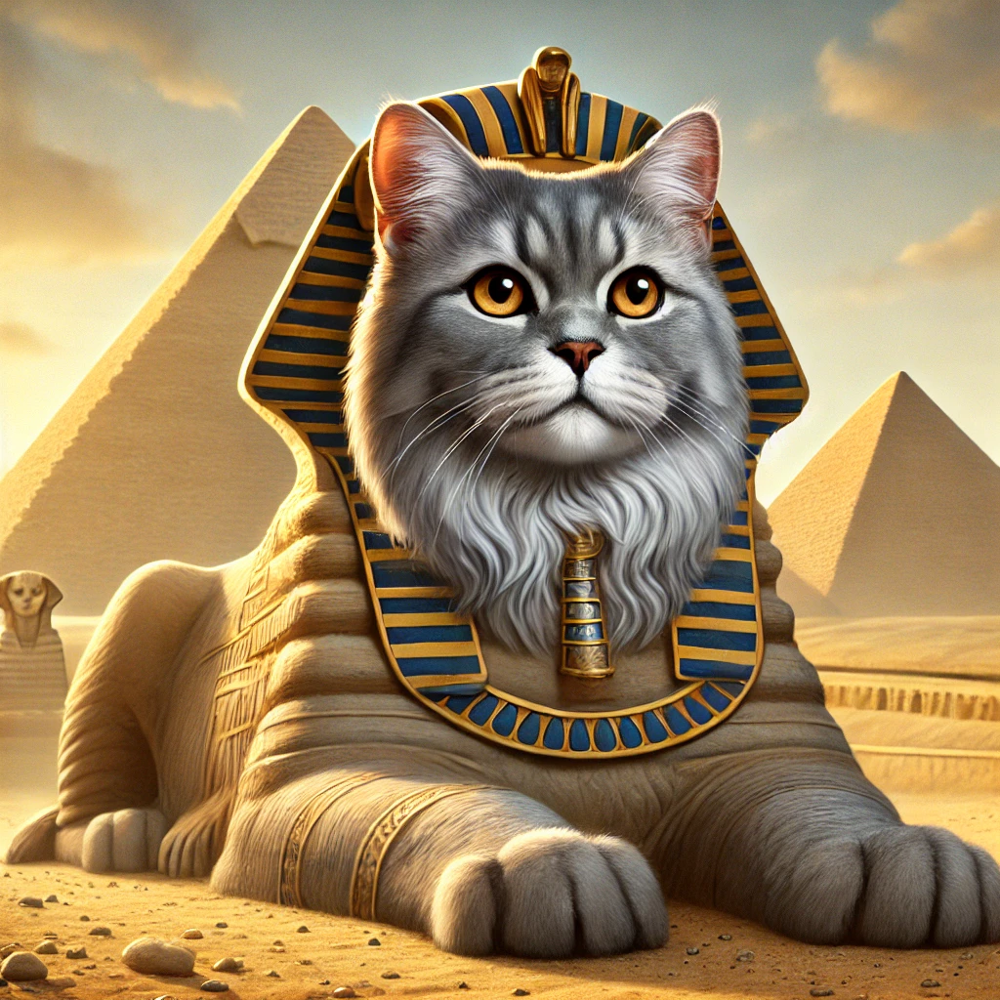

# OtherKitten Lost In Time

This is a history quiz game. The questions are intended to be harder based on how you answer the previous questions. Each question has three levels. Level 1 is the easiest, and Level 3 is the hardest.  

When the questions are asked, The player is presented with a scene introduction and a button to show the question.  When they press the button, the question is displayed along with a count down timer of 30 seconds. 

Once the player answers the question, they must submit the answer (press a button) before the timer is stopped and the question is scored.  When the question is scored, the correct answer should be shown and the score and how it was calculated should be displayed.  The player can then press the next button to go to the next question.

- **Level 1**: You get this if you answered the two previous questions incorrectly.
- **Level 2**: You get this if you answered one of the last two questions correctly.
- **Level 3**: You get this if you answered both the last two questions correctly.

The first question will always be Level 3 with 200 points. The second question will be either Level 2 or Level 3 with 100 or 200 points based on how the user answered the first question. (If they answered it correctly, the second question is Level 2; if they answered it incorrectly, the second question is Level 3.)

- **Level 1 questions**: Worth 50 points each.
- **Level 2 questions**: Worth 100 points each.
- **Level 3 questions**: Worth 200 points each.

The user only sees one question for the segment, so if they are asked a level 1 question, they can only get 50 points for the segment.

The user's score should be displayed prominently at the top of the screen.

The game is a simple HTML/CSS/JavaScript game that runs in the browser.

The landing page will display the story premise and a button to start the game. When the user clicks start the game, the first segment is displayed.

Each segment should present the introduction and then start a countdown timer of 30 seconds. The number of points the user can score for a correct answer is based on the level of the question multiplied by the number of seconds remaining divided by 30, but rounded to the nearest 1 point. For example, if the user answers a level 1 question with 20 seconds remaining, they score 50 * (20 / 30) = 33 points.

The questions should be presented in a random order. The answers should be presented in a random order.  For the questions that ask the player to put events in order, the answers should be presented in a random order.

## Premise: The Time-Locked Cat

**Story Image**: 

You are a historian—or at least, you thought you were—until the day you found Otherkitten, a mysterious cat with an uncanny ability to vanish and reappear in different historical periods. One morning, Otherkitten swats at a strange glowing object on your desk, and suddenly, time distorts around you.

A time rift opens, pulling you and Otherkitten into a strange temporal limbo. A cryptic message appears:

> "Time is broken. The only way forward is through the past."

You realize that to return home, you must navigate through 10 crucial moments in history, solving puzzles to restore the timeline. Otherkitten, somehow tied to these anomalies, appears in each era—sometimes as a clue, sometimes as a troublemaker.

Every puzzle is a test:
- Solve it correctly, and you move forward.
- Fail, and time itself unravels a little more…

Your only hope? Use your knowledge of history, follow the cat, and solve the mysteries before time collapses forever.

## Question 1: The Disappearing Declaration

**Image**: 

**Time Period**: July 4, 1776 – Philadelphia, Pennsylvania

**Historical Event**: The signing of the Declaration of Independence

**Scene Introduction**:

You blink, and the swirling void of the time rift vanishes. The air is thick with humidity, the scent of ink and parchment filling your nose. A commotion surrounds you. Men in powdered wigs and long coats are gathered in a candlelit hall, their voices rising in heated debate.

You realize where you are. Independence Hall.

Otherkitten, perched smugly on a wooden desk, swats at a quill pen. You glance around—no one seems to notice you or the cat. That's when you see it: The Declaration of Independence is missing.

A scrap of parchment flutters at your feet. Scribbled hastily in ink:
> "The fate of a nation is at stake. Find the missing words before it's too late."

To restore the Declaration of Independence, you must answer the following questions correctly:

**Question Level 1 (Answered the two questions incorrectly)**:
"What is the name of the building where the Declaration of Independence was signed?"
1. Independence Hall
2. The White House
3. The Capitol Building
4. The Liberty Bell Center

**Correct Answer**: Independence Hall

**Question Level 2**:
"Who was the primary author of the Declaration of Independence?"
1. George Washington
2. Thomas Jefferson
3. Benjamin Franklin
4. James Madison

**Correct Answer**: Thomas Jefferson

**Question Level 3**:
"Which of the following phrases belongs in the Declaration of Independence?"
1. "Life, Liberty, and the Pursuit of Happiness"
2. "Give me liberty, or give me death!"
3. "Government of the people, by the people, for the people"
4. "One if by land, two if by sea"

**Correct Answer**: "Life, Liberty, and the Pursuit of Happiness"

## Question 2: The Vanishing Victory

**Images**: 

**Time Period**: 44 BCE – Rome, Italy

**Historical Event**: The Assassination of Julius Caesar

**Scene Introduction**:

You barely have time to catch your breath before the time rift deposits you in the heart of ancient Rome. The midday sun glares down on the Roman Senate, where men in togas whisper in tense huddles. A faint scent of olive oil and dust lingers in the air.

Otherkitten lands beside you gracefully, her tail flicking as if sensing trouble.

A loud murmur spreads through the crowd—Julius Caesar is about to enter the Senate. But something is wrong. A critical warning that should have been delivered to Caesar has disappeared from history.

Another parchment flutters at your feet. You pick it up:
> "The Ides of March bring doom, but what was lost seals the tomb."

To set history right and seal Julius Caesar's fate, you must answer the following questions correctly:

**Question Level 1**:
"Which of the following was the famous warning given to Julius Caesar?"
1. "Et tu, Brute?"
2. "Beware the Ides of March."
3. "The eagle will fall before the dawn."
4. "Render unto Caesar what is Caesar's."

**Correct Answer**: "Beware the Ides of March."

**Question Level 2**:
"What was the title given to the leader of the Roman Republic?"
1. Emperor
2. Consul
3. Senator
4. Tribune

**Correct Answer**: Consul

**Question Level 3**:
"Put the following events in chronological order:"
1. Crossing of the Rubicon
2. Assassination of Julius Caesar
3. Death of Cleopatra
4. Battle of Actium

**Correct Answer**: 1, 2, 4, 3

## Question 3: The Mystery of the Missing Map

**Images**: 

**Time Period**: 1492 – Aboard the Santa María, Atlantic Ocean

**Historical Event**: Christopher Columbus's voyage to the New World

**Scene Introduction**:

The time rift spits you out onto the wooden deck of a ship, the salty sea air whipping at your face. Around you, sailors are bustling about, their eyes filled with anticipation—and some with doubt.

A sailor grips a tattered piece of parchment, his hands shaking. "The navigation map… it's missing!"

Otherkitten perches on a wooden barrel, watching the waves. A scrap of paper flutters near its paws, inscribed with a cryptic message:
> "Without the path, the voyage is lost. Find the missing truth before time is tossed."

You realize that Columbus's ability to navigate is in jeopardy. If you don't restore the correct information, history could be thrown off course.

To restore the navigation map, you must answer the following questions correctly:

**Question Level 1**:
"What is the name of the ocean Columbus crossed?"
1. Pacific Ocean
2. Atlantic Ocean
3. Indian Ocean
4. Arctic Ocean

**Correct Answer**: Atlantic Ocean

**Question Level 2**:
"Columbus sailed west in 1492 believing he would reach which country?"
1. India
2. China
3. Portugal
4. Brazil  

**Correct Answer**: India

**Question Level 3**:
"Columbus was granted ships by Spain, but who were the two monarchs that funded him?"
1. Isabella & Ferdinand
2. Henry VIII & Anne Boleyn
3. Philip II & Catherine of Aragon
4. Louis XIV & Marie Antoinette     

**Correct Answer**: Isabella & Ferdinand

## Question 4: The Pharaoh's Lost Inscription
**Images**: 

**Time Period**: 1336 BCE – Ancient Egypt, Valley of the Kings

**Historical Event**: The Reign of Pharaoh Tutankhamun

**Scene Introduction**:

As the time rift settles, the dim glow of flickering torches casts shifting shadows on the stone walls around you. The air is thick with the scent of aged parchment, incense, and dust. You've landed inside an unfinished tomb, deep within the Valley of the Kings.

The chamber is partially excavated, with tools and half-carved inscriptions littering the floor. Hieroglyphics dance along the walls, depicting Pharaoh Tutankhamun's journey to the afterlife. Golden relics, still waiting to be placed, sit in neat rows against one side of the room.

Then you spot Otherkitten—or more accurately, you spot the mess she's making.

The small feline trots toward a half-carved stone tablet, her green eyes glinting with mischief. Before you can react, she playfully swats at some loose hieroglyphics, sending them scattering like leaves in the wind. With a delighted chirp, she chases the tumbling symbols across the smooth stone floor, her paws batting at them as if they were toy mice.

You barely have time to groan before a group of priests enters the chamber, their robes rustling as they walk. They ignore you completely, their attention locked on the now-altered inscription on the tablet. Their faces pale.

> "The Pharaoh's name is missing!" one of them exclaims, his voice filled with alarm.

You glance at Otherkitten, who sits proudly beside the tablet, tail curling smugly. Well, that's a problem.

A familiar scrap of parchment flutters down beside you:
> "The boy king's name must endure, or his legacy will fade. Find what is lost before history is rewritten."

The pressure is on—you need to restore the correct hieroglyphics before the priests unknowingly seal Tutankhamun's tomb with a fatal mistake.

To restore the correct hieroglyphics before the priests unknowingly seal Tutankhamun's tomb with a fatal mistake, you must answer the following questions correctly:

**Question Level 1**:
"What was the title given to rulers of Ancient Egypt?"
1. Emperor
2. Pharaoh
3. King
4. Vizier

**Correct Answer**: Pharaoh

**Question Level 2**:
"Which symbol is commonly associated with royal power in Ancient Egypt?"
1. Ankh (☥)
2. Lotus Flower
3. Pyramid
4. Eye of Horus

**Correct Answer**: Ankh (☥)

**Question Level 3**:
"Tutankhamun's tomb contained a famous artifact inscribed with a protective spell. What was it?"
1. The Book of the Dead
2. The Rosetta Stone
3. The Death Mask Inscription
4. The Pyramid Texts

**Correct Answer**: The Death Mask Inscription
