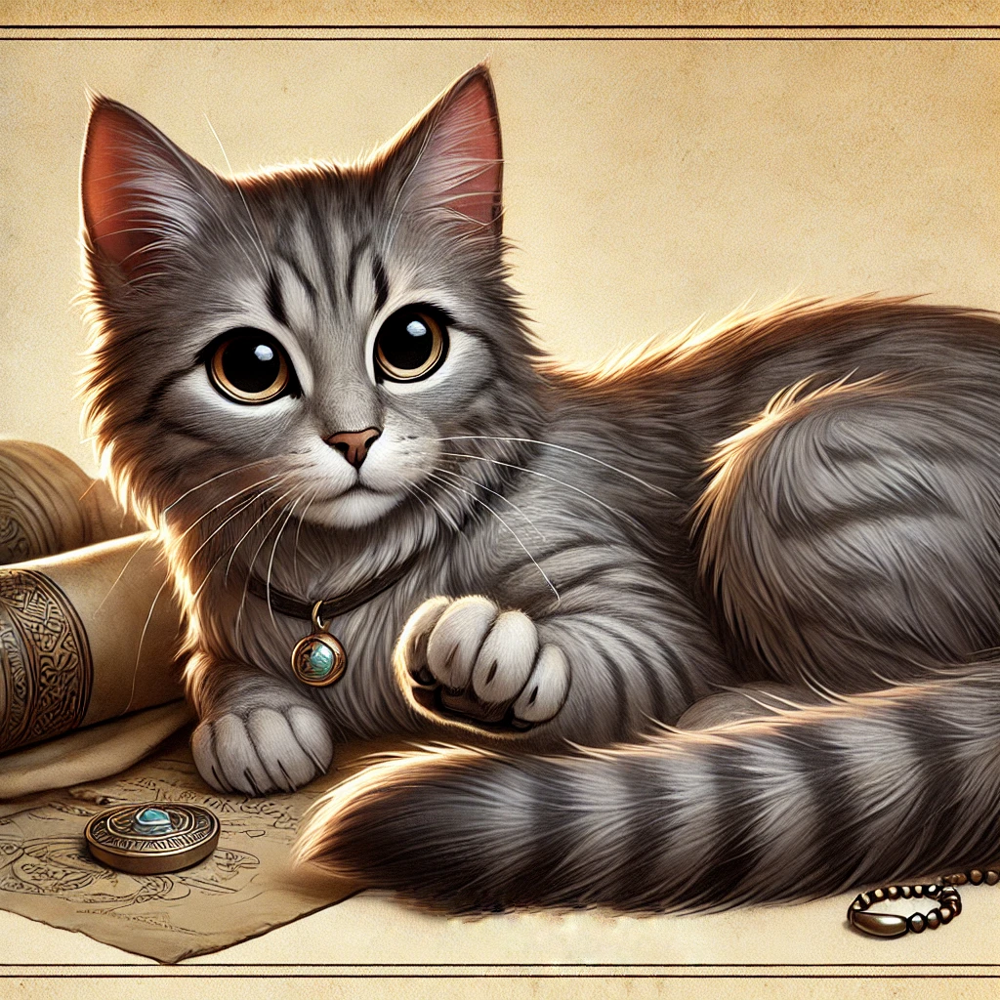

# OtherKitten Lost In Time

## Overview:
This is a history quiz game. The questions are intended to be harder based on how you answer the previous questions. Each question has three levels. Level 1 is the easiest, and Level 3 is the hardest.  

## Game Start:
The game should start from a landing page that displays the story premise, the story image, and a button to start the game. 

## Game Flow:
The game is broken into segments.  Each segment represents a different significant moment in history.  A segment includes a set of questions/answers about this moment.  These questions are ranked at three levels.  Level 1 is the easiest, and Level 3 is the hardest.

Each segment should present the introduction for that segment and a button that says:  "Ask Question".

When the user presses the button, the question and answer choices for that segment should be shown, a submit answer button will be displayed and a 30 second countdown timer started.

Level of the question is based on the answers to the two previous questions.  1 - Show this if the player answered the two previous questions incorrectly, 2 - Show this if the player answered one of the last two questions correctly, 3 - Show this if the player answered both the last two questions correctly.

The user must answer the question and press the submit answer button for the timer to stop and the question to be scored.

After the submit answer button is pressed, the timer should stop and the question should be scored.  The score should be displayed along with how the score was calculated.  At the same time, a next question button should be displayed.

When the user presses the next question button, go to the next question.  If there are no more questions, display a "Game Over" screen that displays the final score and a button to play again.

## Scoring:
The number of points the user can score for a correct answer is based on the level of the question multiplied by the number of seconds remaining divided by 30, but rounded to the nearest 1 point. For example, if the user answers a level 1 question with 20 seconds remaining, they score 50 * (20 / 30) = 33 points.

The first question will always be Level 3 with 200 points. The second question will be either Level 2 or Level 3 with 100 or 200 points based on how the user answered the first question. (If they answered it correctly, the second question is Level 2; if they answered it incorrectly, the second question is Level 3.)

- **Level 1 questions**: Worth 50 points each.
- **Level 2 questions**: Worth 100 points each.
- **Level 3 questions**: Worth 200 points each.

The user only sees one question for the segment, so if they are asked a level 1 question, they can only get 50 points for the segment.

The user's score should be displayed prominently at the top of the screen.

## Implementation:
The game is meant to be played on a phone. The game should be a simple HTML/CSS/JavaScript game that runs in the browser.

## Game Style:
The colors should be base on the colors of the historical segment that the questions are about.  Each segment has an accompanying image that can be used to determine the colors.  Because of this, Each scene has a different color scheme.

The game should have a nice responsive design that works on desktop, tablet, and mobile devices.  The game should be playable on a phone.

## Deployment:
We are going to host this site on github pages so only static content is allowed.

## Testing:
We are going to test the game using manual testing, but may want to build an automated test suite in the future.

## Randomization:
The questions should be presented in a random order. The answers should be presented in a random order.  For the questions that ask the player to put events in order, the answers should be presented in a random order.

## StoryPremise: The Time-Locked Cat

**Story Image**: 

You are a historian—or at least, you thought you were—until the day you found Otherkitten, a mysterious cat with an uncanny ability to vanish and reappear in different historical periods. One morning, Otherkitten swats at a strange glowing object on your desk, and suddenly, time distorts around you.

A time rift opens, pulling you and Otherkitten into a strange temporal limbo. A cryptic message appears:

> "Time is broken. The only way forward is through the past."

You realize that to return home, you must navigate through 10 crucial moments in history, solving puzzles to restore the timeline. Otherkitten, somehow tied to these anomalies, appears in each era—sometimes as a clue, sometimes as a troublemaker.

Every puzzle is a test:
- Solve it correctly, and you move forward.
- Fail, and time itself unravels a little more…

Your only hope? Use your knowledge of history, follow the cat, and solve the mysteries before time collapses forever.

## Question 1: The Disappearing Declaration

**Image**: 

**Time Period**: July 4, 1776 – Philadelphia, Pennsylvania

**Historical Event**: The signing of the Declaration of Independence

**Scene Introduction**:

You blink, and the swirling void of the time rift vanishes. The air is thick with humidity, the scent of ink and parchment filling your nose. A commotion surrounds you. Men in powdered wigs and long coats are gathered in a candlelit hall, their voices rising in heated debate.

You realize where you are. Independence Hall.

Otherkitten, perched smugly on a wooden desk, swats at a quill pen. You glance around—no one seems to notice you or the cat. That's when you see it: The Declaration of Independence is missing.

A scrap of parchment fluttered at your feet. Scribbled hastily in ink:
> "The fate of a nation is at stake. Find the missing words before it's too late."

To restore the Declaration of Independence, you must answer the following questions correctly:

**Question Level 1 (Answered the two questions incorrectly)**:
"What is the name of the building where the Declaration of Independence was signed?"
1. Independence Hall
2. The White House
3. The Capitol Building
4. The Liberty Bell Center

**Correct Answer**: Independence Hall

**Question Level 2**:
"Who was the primary author of the Declaration of Independence?"
1. George Washington
2. Thomas Jefferson
3. Benjamin Franklin
4. James Madison

**Correct Answer**: Thomas Jefferson

**Question Level 3**:
"Which of the following phrases belongs in the Declaration of Independence?"
1. "Life, Liberty, and the Pursuit of Happiness"
2. "Give me liberty, or give me death!"
3. "Government of the people, by the people, for the people"
4. "One if by land, two if by sea"

**Correct Answer**: "Life, Liberty, and the Pursuit of Happiness"

## Question 2: The Vanishing Victory

**Images**: 

**Time Period**: 44 BCE – Rome, Italy

**Historical Event**: The Assassination of Julius Caesar

**Scene Introduction**:

You barely have time to catch your breath before the time rift deposits you in the heart of ancient Rome. The midday sun glares down on the Roman Senate, where men in togas whisper in tense huddles. A faint scent of olive oil and dust lingers in the air.

Otherkitten lands beside you gracefully, her tail flicking as if sensing trouble.

A loud murmur spreads through the crowd—Julius Caesar is about to enter the Senate. But something is wrong. A critical warning that should have been delivered to Caesar has disappeared from history.

Another parchment fluttered at your feet. You pick it up:
> "The Ides of March bring doom, but what was lost seals the tomb."

To set history right and seal Julius Caesar's fate, you must answer the following questions correctly:

**Question Level 1**:
"Which of the following was the famous warning given to Julius Caesar?"
1. "Et tu, Brute?"
2. "Beware the Ides of March."
3. "The eagle will fall before the dawn."
4. "Render unto Caesar what is Caesar's."

**Correct Answer**: "Beware the Ides of March."

**Question Level 2**:
"What was the title given to the leader of the Roman Republic?"
1. Emperor
2. Consul
3. Senator
4. Tribune

**Correct Answer**: Consul

**Question Level 3**:
"Put the following events in chronological order:"
1. Crossing of the Rubicon
2. Assassination of Julius Caesar
3. Death of Cleopatra
4. Battle of Actium

**Correct Answer**: 1, 2, 4, 3

## Question 3: The Mystery of the Missing Map

**Images**: 

**Time Period**: 1492 – Aboard the Santa María, Atlantic Ocean

**Historical Event**: Christopher Columbus's voyage to the New World

**Scene Introduction**:

The time rift spits you out onto the wooden deck of a ship, the salty sea air whipping at your face. Around you, sailors are bustling about, their eyes filled with anticipation—and some with doubt.

A sailor grips a tattered piece of parchment, his hands shaking. "The navigation map… it's missing!"

Otherkitten perches on a wooden barrel, watching the waves. A scrap of paper fluttered near its paws, inscribed with a cryptic message:
> "Without the path, the voyage is lost. Find the missing truth before time is tossed."

You realize that Columbus's ability to navigate is in jeopardy. If you don't restore the correct information, history could be thrown off course.

To restore the navigation map, you must answer the following questions correctly:

**Question Level 1**:
"What is the name of the ocean Columbus crossed?"
1. Pacific Ocean
2. Atlantic Ocean
3. Indian Ocean
4. Arctic Ocean

**Correct Answer**: Atlantic Ocean

**Question Level 2**:
"Columbus sailed west in 1492 believing he would reach which country?"
1. India
2. China
3. Portugal
4. Brazil  

**Correct Answer**: India

**Question Level 3**:
"Columbus was granted ships by Spain, but who were the two monarchs that funded him?"
1. Isabella & Ferdinand
2. Henry VIII & Anne Boleyn
3. Philip II & Catherine of Aragon
4. Louis XIV & Marie Antoinette     

**Correct Answer**: Isabella & Ferdinand

## Question 4: The Pharaoh's Lost Inscription
**Images**: 

**Time Period**: 1336 BCE – Ancient Egypt, Valley of the Kings

**Historical Event**: The Reign of Pharaoh Tutankhamun

**Scene Introduction**:

As the time rift settles, the dim glow of flickering torches casts shifting shadows on the stone walls around you. The air is thick with the scent of aged parchment, incense, and dust. You've landed inside an unfinished tomb, deep within the Valley of the Kings.

The chamber is partially excavated, with tools and half-carved inscriptions littering the floor. Hieroglyphics dance along the walls, depicting Pharaoh Tutankhamun's journey to the afterlife. Golden relics, still waiting to be placed, sit in neat rows against one side of the room.

Then you spot Otherkitten—or more accurately, you spot the mess she's making.

The small feline trots toward a half-carved stone tablet, her green eyes glinting with mischief. Before you can react, she playfully swats at some loose hieroglyphics, sending them scattering like leaves in the wind. With a delighted chirp, she chases the tumbling symbols across the smooth stone floor, her paws batting at them as if they were toy mice.

You barely have time to groan before a group of priests enters the chamber, their robes rustling as they walk. They ignore you completely, their attention locked on the now-altered inscription on the tablet. Their faces pale.

> "The Pharaoh's name is missing!" one of them exclaims, his voice filled with alarm.

You glanced at Otherkitten, who sits proudly beside the tablet, tail curling smugly. Well, that's a problem.

A familiar scrap of parchment fluttered down beside you:
> "The boy king's name must endure, or his legacy will fade. Find what is lost before history is rewritten."

The pressure is on—you need to restore the correct hieroglyphics before the priests unknowingly seal Tutankhamun's tomb with a fatal mistake.

To restore the correct hieroglyphics before the priests unknowingly seal Tutankhamun's tomb with a fatal mistake, you must answer the following questions correctly:

**Question Level 1**:
"What was the title given to rulers of Ancient Egypt?"
1. Emperor
2. Pharaoh
3. King
4. Vizier

**Correct Answer**: Pharaoh

**Question Level 2**:
"Which symbol is commonly associated with royal power in Ancient Egypt?"
1. Ankh (☥)
2. Lotus Flower
3. Pyramid
4. Eye of Horus

**Correct Answer**: Ankh (☥)

**Question Level 3**:
"Tutankhamun's tomb contained a famous artifact inscribed with a protective spell. What was it?"
1. The Book of the Dead
2. The Rosetta Stone
3. The Death Mask Inscription
4. The Pyramid Texts

**Correct Answer**: The Death Mask Inscription

## Question 5: The Chains of History

**Images**: 

**Time Period**: 19th Century – The Atlantic Ocean

**Historical Event**: The Transatlantic Slave Trade

**Scene Introduction**:

The time rift deposits you onto the deck of a large ship, the creaking of wood and the sound of waves crashing against the hull filling your ears. The air is heavy with the scent of salt and despair. You find yourself aboard a slave ship, a grim reminder of one of history's darkest chapters.

Otherkitten sits solemnly on a coil of rope, her eyes reflecting the sorrow of the souls below deck. A tattered piece of parchment fluttered in the wind, landing at your feet. It reads:
> "The chains of history must be broken. Find the truth to set them free."

To ensure the truth of this era is preserved and to honor those who suffered, you must answer the following questions correctly:

**Question Level 1**:
"What was the primary destination for enslaved Africans during the Transatlantic Slave Trade?"
1. The Caribbean
2. Europe
3. Asia
4. Australia

**Correct Answer**: The Caribbean

**Question Level 2**:
"Which year did the United States officially abolish the transatlantic slave trade?"
1. 1776
2. 1808
3. 1865
4. 1900

**Correct Answer**: 1808

**Question Level 3**:
"Which of the following was a key figure in the abolitionist movement in the United States?"
1. Harriet Tubman
2. George Washington
3. Thomas Jefferson
4. Andrew Jackson

**Correct Answer**: Harriet Tubman

## Question 6: The Trial of the Stars

**Images**: 

**Time Period**: 1633 – Rome, Italy

**Historical Event**: The Trial of Galileo Galilei

**Scene Introduction**:

The time rift opens, and you find yourself in a dimly lit chamber filled with the scent of old books and candle wax. The room is tense with anticipation as Galileo Galilei stands before the Inquisition, defending his revolutionary ideas about the cosmos.

Otherkitten sits quietly on a windowsill, her eyes fixed on the night sky. A piece of parchment flutters down beside you, inscribed with a message:
> "The truth of the stars must shine. Find the answers to light the way."

To ensure Galileo's legacy endures, you must answer the following questions correctly:

**Question Level 1**:
"What did Galileo use to observe the heavens?"
1. Microscope
2. Telescope
3. Binoculars
4. Sextant

**Correct Answer**: Telescope

**Question Level 2**:
"Which celestial body did Galileo discover had moons orbiting it?"
1. Mars
2. Venus
3. Jupiter
4. Saturn

**Correct Answer**: Jupiter

**Question Level 3**:
"Which book by Galileo supported the heliocentric model of the solar system?"
1. The Starry Messenger
2. Dialogue Concerning the Two Chief World Systems
3. Principia Mathematica
4. On the Revolutions of the Celestial Spheres

**Correct Answer**: Dialogue Concerning the Two Chief World Systems

## Question 7: The Dream of Equality

**Images**: 

**Time Period**: 1963 – Washington, D.C.

**Historical Event**: The March on Washington for Jobs and Freedom

**Scene Introduction**:

The time rift opens, and you find yourself amidst a massive crowd gathered at the Lincoln Memorial. The air is filled with hope and determination as Martin Luther King Jr. prepares to deliver his iconic speech.

Otherkitten sits on the steps, her eyes reflecting the spirit of the moment. A piece of parchment flutters down beside you, inscribed with a message:
> "The dream must be heard. Find the truth to keep it alive."

To honor Martin Luther King Jr.'s legacy, you must answer the following questions correctly:

**Question Level 1**:
"What is the name of Martin Luther King Jr.'s famous speech delivered during the March on Washington?"
1. "I Have a Dream"
2. "The Gettysburg Address"
3. "The Emancipation Proclamation"
4. "The Four Freedoms"

**Correct Answer**: "I Have a Dream"

**Question Level 2**:
"In which year did Martin Luther King Jr. receive the Nobel Peace Prize?"
1. 1955
2. 1964
3. 1970
4. 1980

**Correct Answer**: 1964

**Question Level 3**:
"Which legislation was passed in part due to Martin Luther King Jr.'s efforts in the civil rights movement?"
1. The Civil Rights Act of 1964
2. The Voting Rights Act of 1965
3. The Fair Housing Act of 1968
4. All of the above

**Correct Answer**: All of the above

## Question 8: The Voices of the Land

**Images**: 

**Time Period**: 19th Century – United States

**Historical Event**: The Trail of Tears

**Scene Introduction**:

The time rift opens, and you find yourself on a dusty trail stretching across the horizon. The air is heavy with sorrow as you witness the forced relocation of Native American tribes from their ancestral lands.

Otherkitten walks beside you, her eyes reflecting the resilience of the people. A piece of parchment flutters down beside you, inscribed with a message:
> "The voices of the land must be heard. Find the truth to honor their legacy."

To honor the history and resilience of Native American tribes, you must answer the following questions correctly:

**Question Level 1**:
"Which Native American tribe was primarily affected by the Trail of Tears?"
1. Cherokee
2. Sioux
3. Apache
4. Navajo

**Correct Answer**: Cherokee

**Question Level 2**:
"Which U.S. President signed the Indian Removal Act, leading to the Trail of Tears?"
1. George Washington
2. Thomas Jefferson
3. Andrew Jackson
4. Abraham Lincoln

**Correct Answer**: Andrew Jackson

**Question Level 3**:
"Which landmark Supreme Court case ruled in favor of the Cherokee Nation's sovereignty?"
1. Marbury v. Madison
2. Worcester v. Georgia
3. Brown v. Board of Education
4. Dred Scott v. Sandford

**Correct Answer**: Worcester v. Georgia

## Question 9: The Fight for the Vote

**Images**: 

**Time Period**: Early 20th Century – United States

**Historical Event**: The Women's Suffrage Movement

**Scene Introduction**:

The time rift opens, and you find yourself in a bustling city street filled with women marching for their right to vote. The air is charged with determination and hope as banners wave and voices rise in unison.

Otherkitten sits atop a nearby lamppost, her eyes reflecting the courage of the suffragettes. A piece of parchment flutters down beside you, inscribed with a message:
> "The voices of change must be heard. Find the truth to honor their struggle."

To honor the women's suffrage movement, you must answer the following questions correctly:

**Question Level 1**:
"What amendment to the U.S. Constitution granted women the right to vote?"
1. 15th Amendment
2. 19th Amendment
3. 21st Amendment
4. 26th Amendment

**Correct Answer**: 19th Amendment

**Question Level 2**:
"Who was a prominent leader in the American women's suffrage movement?"
1. Susan B. Anthony
2. Eleanor Roosevelt
3. Rosa Parks
4. Harriet Tubman

**Correct Answer**: Susan B. Anthony

**Question Level 3**:
"In which year was the 19th Amendment ratified, granting women the right to vote in the United States?"
1. 1919
2. 1920
3. 1921
4. 1922

**Correct Answer**: 1920

## Question 10: The Lines of Inequality

**Images**: 

**Time Period**: 20th Century – United States

**Historical Event**: The Practice of Redlining

**Scene Introduction**:

The time rift opens, and you find yourself in a city planning office, surrounded by maps marked with red lines. The air is tense with the weight of decisions that will shape communities for generations.

Otherkitten sits on a desk, her eyes reflecting the impact of these boundaries. A piece of parchment flutters down beside you, inscribed with a message:
> "The lines of inequality must be erased. Find the truth to pave the way for justice."

To understand and address the impact of redlining, you must answer the following questions correctly:

**Question Level 1**:
"What was the primary purpose of redlining maps?"
1. To identify tourist attractions
2. To designate areas for investment
3. To outline public transportation routes
4. To mark historical landmarks

**Correct Answer**: To designate areas for investment

**Question Level 2**:
"Which government agency was responsible for creating redlining maps in the United States?"
1. Federal Housing Administration (FHA)
2. Department of Transportation (DOT)
3. Environmental Protection Agency (EPA)
4. National Park Service (NPS)

**Correct Answer**: Federal Housing Administration (FHA)

**Question Level 3**:
"What was one major consequence of redlining on affected communities?"
1. Increased property values
2. Improved public services
3. Economic disinvestment
4. Enhanced educational opportunities

**Correct Answer**: Economic disinvestment
